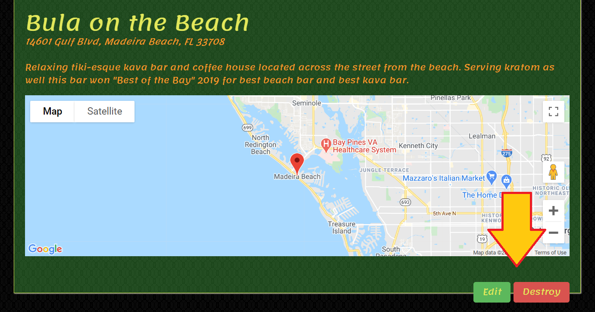

# README

This is a ratings and review site. Users can create or "list" a new place with an address that will show others on a map as to where the business is using a Google Maps API.
Users are also able to leave reviews/ comments and ratings (1-5 stars)
https://nomster-matt-parr.herokuapp.com to see the app.

Users can sign up and create a profile in this app. On the user profile page it will display places they've listed and comments ("Squawks") that have been made("My Tribe").
Clicking on the place name will bring user to the places page with location and ratings/ comments.

Comments and photos can also be added to the location pages under "Kava Squawk".

Users also have a profile page which shows them the comments they have left (and place names the comment resides in) as well as the places they have added to the app.

Here they can click on a place they have created and choose to "Edit" or "Destory" the place. Only the user that created the place initially can remove listed location.

